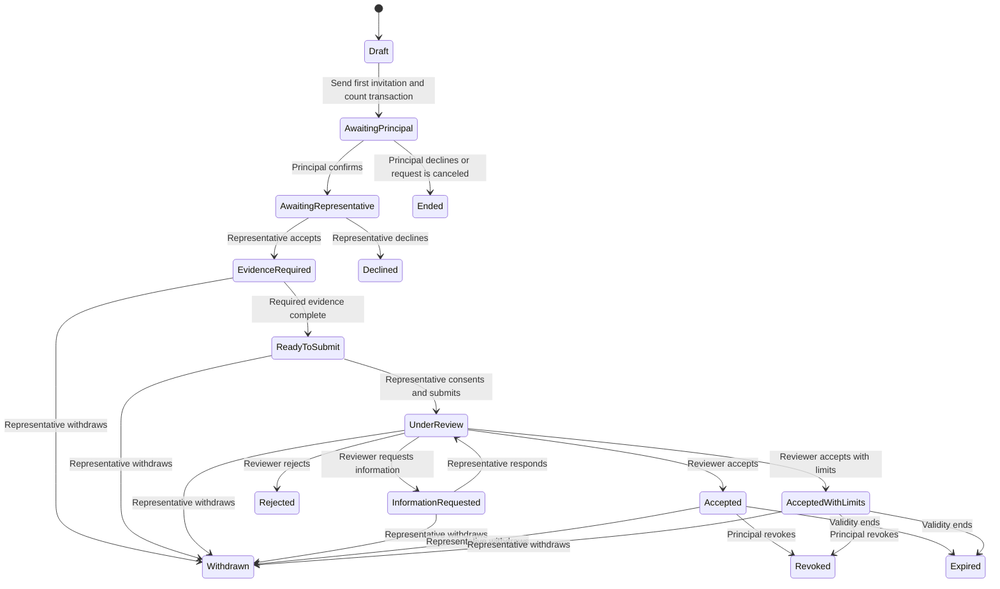
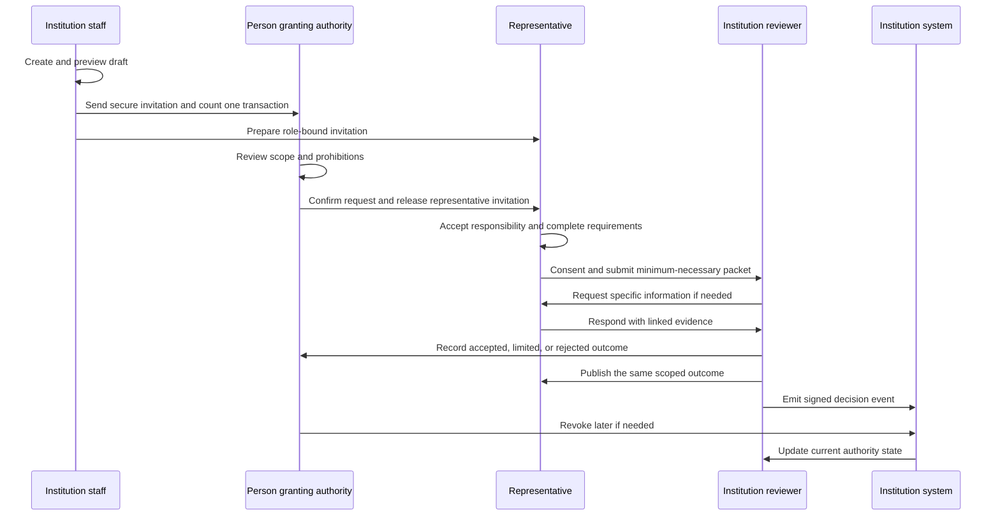

# Passage Authority product source of truth

**Version:** 1.7
**Date:** September 3, 2026
**Status:** Active build and release contract  
**Owner decision:** The hosted synthetic flow has passed organization onboarding, request activation, separate participant decisions, private sample-file upload, human review, clarification and response, institution acceptance with limits, matching three-party receipt, secure-session recovery, and revocation on the public domain. Remaining demo gates are independent browser-profile replay, the negative-path matrix, reset hardening, deliverability, and operating evidence. Stripe and CRM automation follow those gates.

This document replaces contradictory product, pricing, onboarding, persona, and roadmap assumptions in earlier Passage Authority plans. If another document conflicts with this one, this document controls until an explicit decision updates it.

## 1. Mission and product promise

Passage Authority makes it easy and safe for one person to act for another across an institution.

The product turns a fragmented authority request into one guided transaction with:

- named people and organizations;
- an explicit reason for the request;
- exact actions that are allowed and prohibited;
- evidence requirements defined by the receiving institution;
- identity, evidence, consent, and acceptance shown as separate results;
- one accountable owner for every next step;
- a durable decision receipt;
- current status, including expiration, withdrawal, and revocation;
- system events that can synchronize the decision with existing software.

The user experience must make a complicated legal and operational process feel calm, guided, and understandable. The product does not make universal legal decisions. The receiving institution retains its decision authority.

## 2. The commercial wedge

### 2.1 Initial buyer

Regional banks and credit unions with manual financial power of attorney intake and review.

### 2.2 Initial operational owner

Deposit operations, member operations, trust operations, compliance operations, or another team that receives and reviews financial power of attorney requests.

### 2.3 Initial transaction

A capable adult asks a financial institution to recognize a trusted representative for a narrow set of non-transactional account-service actions under a New York financial power of attorney.

The institution defines the policy and decides whether to accept, limit, reject, or request more information.

### 2.4 Initial permitted actions

- Receive duplicate statements for a named account boundary.
- Discuss defined account-service questions.

### 2.5 Explicitly prohibited in the first release

- Move, withdraw, or transfer money.
- Open or close an account.
- Add or remove an owner.
- Change beneficiaries.
- Trade investments.
- Borrow money or open credit.
- Change credentials or take over the principal's digital banking access.
- Make an automatic legal-validity determination.

### 2.6 Two supported entry modes

The two use cases share one data model and one review transaction. They are not separate products.

| Mode | Starts the request | Best first use | Release priority |
| --- | --- | --- | --- |
| Institution initiated | An authenticated institution staff member | A bank or credit union invites its customer and representative | MVP and first pilot |
| Professional initiated | An authenticated elder-law professional or authorized service organization | A professional prepares a request for a receiving institution | Controlled UAT after the institution flow is stable |

The professional-initiated mode may invite a receiving reviewer through a secure, single-record link. A reviewer account is optional for one isolated review and required for a queue, reusable policy, team administration, or integrations.

## 3. Category and differentiation

### 3.1 Category

Passage Authority is an authority acceptance workflow and API.

It is not a document generator, electronic signature provider, remote notary, identity provider, estate-administration suite, family monitoring product, case-management system, or universal authority registry.

### 3.2 The differentiated job

Passage coordinates the whole institutional decision:

1. Who is asking to act for whom?
2. What is the source of the claimed authority?
3. What exact actions are requested?
4. What does this institution require for this request?
5. Which identity and evidence checks were completed, by whom, and from what source?
6. What did the institution accept, reject, or limit?
7. Is that decision still current now?

Identity vendors answer who someone is. Signature and notary services support execution. Estate tools manage matters. Passage must win by making the institution-specific acceptance, remediation, decision, receipt, and lifecycle easy to complete and easy to integrate.

### 3.3 Competitive truth

TrustElevate publicly claims identity and delegated-authority infrastructure, including power of attorney relationships, scoped credentials, audit history, and revocation. Passage therefore cannot claim that no delegated-authority infrastructure exists.

The viable differentiation to prove is narrower:

- United States institution-specific authority acceptance;
- a product-led, no-code template experience for operations teams;
- a calm hosted journey for principals and representatives;
- policy requirements, evidence sources, human review, accepted scope, and lifecycle in one transaction;
- a receipt and API event that existing systems can consume without making Passage the institution's core system of record;
- a working evaluation path that an institution can test before a long implementation.

This differentiation is a hypothesis until an external institution confirms that its current tools do not already provide the complete transaction.

## 4. Product principles

1. One clear next action per person.
2. Explain the benefit and boundary before asking for data.
3. Ask each fact once and reuse it with visible provenance.
4. Use human terms on human screens.
5. Keep identity, document evidence, policy completion, and institutional acceptance separate.
6. Show allowed and prohibited actions in plain verbs.
7. The institution owns policy and the final decision.
8. No request counts as working until the receiving person can see and act on the result.
9. Every material mutation creates durable state and an append-only event.
10. Existing requests and receipts remain accessible when a trial or contract ends.
11. No production claim appears before the corresponding control is verified.
12. No new authority type or persona is added until the first wedge passes external UAT.

## 5. Commercial model

### 5.1 Approved offer ladder

| Offer | Price | Duration | Included requests | Payment and entitlement |
| --- | ---: | ---: | ---: | --- |
| Try Passage Authority | $0 | 10 calendar days from first activation | 5 synthetic evaluation requests | No card. Passage entitlement only. |
| Founding proof-of-concept pilot | $5,000 | 60 to 90 days | Defined in the signed pilot scope | Paid by Stripe invoice or approved checkout. Credited toward year one when converted under the pilot agreement. |
| Institution relationship | Custom after pilot evidence | Contracted term | Included volume and any overage terms are set after pilot evidence | Activated only from a verified Stripe payment or subscription event. |

### 5.2 What counts as a transaction

An evaluation request counts when its first participant invitation is issued.

- Draft creation does not count.
- Previewing a request does not count.
- Editing a draft does not count.
- Sending the first principal or representative invitation activates and counts the request once.
- Resending an invitation does not count again.
- A request remains one transaction through information requests, decision, expiration, withdrawal, rejection, or revocation.
- The fifth trial request may finish normally.
- The sixth new activation is blocked until a paid entitlement is active.
- An expired trial blocks new activations but never blocks access to existing requests, responses, decisions, receipts, or required data export.

### 5.3 Trial clock

The 10-day evaluation clock begins when the first sample request is activated. Account creation, organization setup, template preview, and saved drafts do not start the clock.

### 5.4 Paid access rule

The product never trusts a browser redirect as proof of payment. Paid entitlement is activated or changed only after a verified Stripe webhook has been stored idempotently and reconciled to the organization.

### 5.5 Commercial boundaries

- The current free evaluation uses approved synthetic information only. Real institution or participant information requires a separately approved pilot boundary.
- No anonymous public checkout grants product access.
- The $5,000 founding pilot is a defined proof-of-concept engagement, not a self-serve commodity purchase.
- Annual included volume remains a commercial decision to be set from real pilot usage. The website must not invent a limit or overage fee.

## 6. Personas and access model

### 6.1 Personas

| Persona | Main job | Account requirement | Scope |
| --- | --- | --- | --- |
| Commercial visitor | Understand the product and decide whether to evaluate it | None | Public information only |
| Organization owner | Create the organization, accept terms, manage access, billing, and policy | Full account, verified email, MFA before real data | Entire organization |
| Organization administrator | Manage people, templates, integrations, and usage | Full account, verified email, MFA before real data | Entire organization except owner-only actions |
| Institution staff | Start requests and see assigned operational work | Full account | Assigned or organization-authorized records |
| Institution reviewer | Review evidence, request information, and record the institution decision | Full account for institution-originated flow | Assigned or authorized records |
| External receiving reviewer | Review one professional-originated request | Secure expiring invitation. Account optional for one record. | One record only |
| Principal | Understand, grant, decline, monitor, and revoke | Secure expiring invitation. No password required. | One record and own actions |
| Representative | Accept or decline, provide evidence, respond, submit, monitor, and withdraw | Secure expiring invitation. No password required. | One record and own actions |
| Developer or integrator | Manage keys, test records, webhooks, and logs | Full account with explicit developer role | Organization integration resources |
| Auditor | Reconstruct decisions and access history | Full account with read-only role | Approved records and audit exports |
| Passage support | Resolve access and delivery issues without making authority decisions | Passage-managed account, step-up access, audited support session | Minimum necessary support scope |

### 6.2 Nobody is anonymous inside a transaction

Public visitors may browse the website and fictional sandbox. Every real transaction action must resolve to:

- a verified organization user session; or
- a single-use, expiring invitation exchanged for a role-bound session.

The server derives organization, record, role, and allowed commands. The browser never supplies trusted authorization claims.

### 6.3 Invitation contract

- Invitation tokens are random, single use, stored only as hashes, and expire.
- Accepting a link creates a role-bound, record-bound session.
- Forwarding or reusing an accepted link does not create a second session.
- A participant may request a fresh link only through the intended email channel.
- Invitations can be revoked by an authorized organization user.
- Revocation ends unused invitations and active participant sessions for that record.
- Participant links never expose another organization's queue or another participant's private evidence.
- High-risk or institution-required actions may add an email code or identity-provider step without creating a password.

## 7. Permission matrix

| Capability | Owner | Admin | Staff | Reviewer | Principal | Representative | External reviewer | Developer | Auditor |
| --- | --- | --- | --- | --- | --- | --- | --- | --- | --- |
| Create organization | Yes | No | No | No | No | No | No | No | No |
| Accept organization terms | Yes | No | No | No | No | No | No | No | No |
| Invite team members | Yes | Yes | No | No | No | No | No | No | No |
| Configure policy | Yes | Yes | View | View | No | No | No | No | View |
| Create draft request | Yes | Yes | Yes | Yes if allowed | No | No | No | API only | No |
| Activate and send request | Yes | Yes | Yes if allowed | Yes if allowed | No | No | No | API if allowed | No |
| Confirm grant | No | No | No | No | Yes | No | No | No | No |
| Accept or decline responsibility | No | No | No | No | No | Yes | No | No | No |
| Complete representative evidence | No | No | No | No | No | Yes | No | No | No |
| Request more information | No | No | No | Yes | No | No | Yes | No | No |
| Record institution decision | No | No | No | Yes | No | No | Yes | No | No |
| Revoke authority | No | No | No | No | Yes | No | No | No | No |
| Withdraw responsibility | No | No | No | No | No | Yes | No | No | No |
| View transaction receipt | Authorized | Authorized | Authorized | Authorized | Own record | Own record | Invited record | API if allowed | Authorized read-only |
| Manage billing | Yes | Optional delegated admin | No | No | No | No | No | No | View only |
| Manage API keys | Yes | Yes if permitted | No | No | No | No | No | Yes | No |
| Export audit package | Yes | Yes | No | Yes if allowed | Own receipt | Own receipt | Invited receipt | API if allowed | Yes |

## 8. Canonical lifecycle



### 8.1 Lifecycle rules

- Draft is visible only to authorized organization users.
- Activation is a first-class command, entitlement decision, event, and notification boundary.
- Participant sessions do not exist before activation.
- Failed commands do not advance the record, consume another transaction, emit a success notification, or create a success event.
- Every accepted, limited, rejected, declined, withdrawn, revoked, and expired outcome keeps a readable receipt.
- Expiration is a durable lifecycle event, not a visual calculation only.
- A reviewer information request is requirement-linked, versioned, and append-only. Only one request may remain open for a record, and a representative response resolves that exact request before review resumes.
- Representative withdrawal requires the active representative session, an explicit reason, acknowledgment, the expected record version, and an idempotency key. It ends future reliance without rewriting earlier evidence, decisions, or receipts.

## 9. Complete MVP use-case catalog

### 9.1 Commercial visitor

| ID | User need | Expected result | MVP |
| --- | --- | --- | --- |
| CV-01 | Understand what Passage does | One-sentence category, one wedge, one example transaction | Yes |
| CV-02 | Understand what Passage does not do | Clear legal and product boundary | Yes |
| CV-03 | See the product before talking to sales | Fictional guided demonstration | Yes |
| CV-04 | Understand pricing | Three approved offers with exact trial and pilot terms | Yes |
| CV-05 | Start free evaluation | Organization signup without a card | Yes |
| CV-06 | Request a pilot | Qualified pilot form and confirmation | Yes |
| CV-07 | Review security posture | Honest current controls and roadmap, with no unsupported certification | Yes |
| CV-08 | Evaluate integration | API concepts, sandbox, events, and webhook behavior | Yes |

### 9.2 Organization owner and administrator

| ID | User need | Expected result | MVP |
| --- | --- | --- | --- |
| OA-01 | Create a company workspace | Verified account and durable organization | Yes |
| OA-02 | Confirm authorized use | Terms, privacy, data-use attestation, and saved acceptance version | Yes |
| OA-03 | Invite staff | Expiring invitation, least-privilege role, acceptance status | Yes |
| OA-04 | Choose a template | New York financial POA template is active; future templates are clearly unavailable | Yes |
| OA-05 | Understand trial usage | Days and activated transactions shown from durable entitlement data | Yes |
| OA-06 | Upgrade | Pilot request or paid flow creates no access until verified payment | Yes |
| OA-07 | Manage billing | Current offer, invoice/payment state, renewal date, and portal access | Yes |
| OA-08 | Revoke staff access | New access stops immediately; audit event remains | Yes |
| OA-09 | Configure retention and notifications | Safe defaults with clear effect | Pilot |
| OA-10 | Review organization audit history | Read-only membership, request, billing, and integration events | Pilot |

### 9.3 Institution staff and reviewer

| ID | User need | Expected result | MVP |
| --- | --- | --- | --- |
| IR-01 | Start from a template | Guided setup with no code | Yes |
| IR-02 | Enter participant details once | Saved draft with duplicate detection | Yes |
| IR-03 | Define the account boundary and permitted actions | Plain-language scope and prohibitions | Yes |
| IR-04 | Preview before sending | See exactly what each participant receives | Yes |
| IR-05 | Activate request | Entitlement checked, transaction counted once, invitations issued | Yes |
| IR-06 | Track all requests | Queue by status, next owner, age, and assignee | Yes |
| IR-07 | Review requirement results | Source, result, date, and items requiring human judgment kept separate | Yes |
| IR-08 | Review source material | Private document preview with cited findings and access log | Pilot |
| IR-09 | Ask for specific information | Requirement-linked request delivered to the representative | Yes |
| IR-10 | Accept, limit, or reject | Reason, scope, limits, policy version, actor, and time saved | Yes |
| IR-11 | See revocation or expiry | Queue, receipt, and integration event update | Yes |
| IR-12 | Reassign review | Authorized reassignment with audit event | Pilot |
| IR-13 | Export a decision package | Policy, evidence references, consent, decision, and lifecycle | Pilot |

### 9.4 Principal

| ID | User need | Expected result | MVP |
| --- | --- | --- | --- |
| P-01 | Know who invited me and why | Sender, institution, purpose, help, and privacy before action | Yes |
| P-02 | Enter securely without a password | Expiring invitation exchanged for role-bound session | Yes |
| P-03 | Understand the request | Allowed and prohibited actions, account boundary, end date | Yes |
| P-04 | Confirm or decline | Explicit choice, no inferred consent | Yes |
| P-05 | See who owns the next step | Current owner and saved result | Yes |
| P-06 | See what was disclosed | Minimum-necessary disclosure receipt | Yes |
| P-07 | See the institution decision | Outcome, accepted actions, limits, and dates | Yes |
| P-08 | Revoke | Consequence review, explicit confirmation, durable event, notifications | Yes |
| P-09 | Resume after leaving | Same current state from a fresh secure link or active session | Yes |
| P-10 | Report coercion or error | Private escalation path that does not notify the suspected person | Pilot |

### 9.5 Representative

| ID | User need | Expected result | MVP |
| --- | --- | --- | --- |
| R-01 | Understand the responsibility | Duties, limits, source, institution, principal, and end date before acceptance | Yes |
| R-02 | Accept or decline | Explicit recorded choice | Yes |
| R-03 | Complete identity and address checks | Provider-hosted or controlled verification result with provenance | Pilot real provider; MVP deterministic sandbox |
| R-04 | Provide the complete POA | Private upload, scan status, pages, and source receipt | Pilot real storage; MVP deterministic sandbox |
| R-05 | Review extracted facts | Correct or flag each cited fact before submission | Pilot |
| R-06 | Complete certification | Versioned attestation and saved receipt | Yes |
| R-07 | See only remaining tasks | Dynamic checklist with reasons and status | Yes |
| R-08 | Review disclosure | Recipient, purpose, results, and fields shown before consent | Yes |
| R-09 | Respond to information request | Requirement-linked response and new evidence | Yes |
| R-10 | See accepted scope | Clear list of what the institution will and will not honor | Yes |
| R-11 | Withdraw | Explicit consequence and durable lifecycle update | Yes |

### 9.6 Developer and auditor

| ID | User need | Expected result | MVP |
| --- | --- | --- | --- |
| D-01 | Test without real data | Isolated fictional sandbox and deterministic scenarios | Yes |
| D-02 | Create a hosted request | Versioned API and idempotent creation | Yes |
| D-03 | Receive lifecycle events | Signed webhooks, retries, and replay | Yes |
| D-04 | Diagnose failures | Request ID, event ID, status, attempt, and response | Yes |
| D-05 | Rotate credentials | Scoped keys and revocation | Pilot |
| A-01 | Reconstruct a decision | Read-only event, actor, policy, evidence, consent, and decision chain | Yes |
| A-02 | Confirm records were not rewritten | Append-only history and version sequence | Yes |

## 10. Screen architecture and route contract

Routes are proposed product contracts. Final names may change once, before implementation. They may not drift screen by screen during development.

### 10.1 Commercial website

| Screen ID | Proposed route | Primary job | Primary action |
| --- | --- | --- | --- |
| W-01 | `/` | Explain category, wedge, workflow, proof, and boundaries | Try free |
| W-02 | `/how-it-works` | Show the transaction across all parties | Start evaluation |
| W-03 | `/templates` | Show active financial POA template and planned templates | Preview template |
| W-04 | `/pricing` | Explain free, pilot, and annual offers | Try free |
| W-05 | `/security` | Explain data, access, architecture, and readiness honestly | Review security |
| W-06 | `/developers` | Explain API objects, hosted flow, events, and sandbox | Open sandbox |
| W-07 | `/demo` | Start a resettable fictional story | Start demonstration |
| W-08 | `/pilot` | Qualify a founding pilot | Request pilot |

### 10.2 Account and organization onboarding

| Screen ID | Proposed route | Primary job | Primary action |
| --- | --- | --- | --- |
| O-01 | `/start` | Collect work email and name | Send secure sign-in link |
| O-02 | `/auth/confirm` | Exchange the secure link and establish session | Continue |
| O-03 | `/onboarding/organization` | Create verified organization profile | Save organization |
| O-04 | `/onboarding/terms` | Record authorized-use, terms, and privacy acceptance | Accept and continue |
| O-05 | `/onboarding/template` | Select the active policy template and safe defaults | Use template |
| O-06 | `/onboarding/complete` | Explain trial rule and first action | Create first draft |

### 10.3 Institution workspace

| Screen ID | Proposed route | Primary job | Primary action |
| --- | --- | --- | --- |
| I-01 | `/app` | Show queue, urgent next work, and trial usage | Start request |
| I-02 | `/app/requests/new` | Create and save a draft in four steps | Save draft |
| I-03 | `/app/requests/[id]/preview` | Preview participant messages, scope, and policy | Send invitations |
| I-04 | `/app/requests/[id]` | Review one canonical record and act | Contextual next action |
| I-05 | `/app/requests/[id]/decision` | Request information or record a decision | Save decision |
| I-06 | `/app/requests/[id]/receipt` | Read and export current decision and lifecycle | Export |
| I-07 | `/app/team` | Invite, role, revoke, and audit organization members | Invite member |
| I-08 | `/app/policies` | View active policy and version history | View policy |
| I-09 | `/app/usage` | See entitlement, transaction count, days, and invoices | Upgrade or manage billing |
| I-10 | `/app/integrations` | Manage API clients, webhook endpoints, and deliveries | Add endpoint |
| I-11 | `/app/audit` | Review organization access and transaction events | Export audit |

### 10.4 Hosted participant experience

| Screen ID | Proposed route | Primary job | Primary action |
| --- | --- | --- | --- |
| H-01 | `/r/[token]` | Explain sender, purpose, privacy, and secure access | Continue securely |
| H-02 | `/r/[token]/confirm` | Establish role-bound session or handle expired link | Open request |
| H-03 | `/request/[id]/overview` | Explain current status and scope | Start my step |
| H-04 | `/request/[id]/grant` | Principal reviews and confirms or declines | Confirm request |
| H-05 | `/request/[id]/responsibility` | Representative accepts or declines | Accept responsibility |
| H-06 | `/request/[id]/requirements` | Show only remaining requirements with reasons | Continue next task |
| H-07 | `/request/[id]/documents/[requirement]` | Upload and review a required document | Save document |
| H-08 | `/request/[id]/review-share` | Show exactly what will be shared | Consent and submit |
| H-09 | `/request/[id]/respond` | Resolve one information request | Send response |
| H-10 | `/request/[id]/status` | Show owner, progress, decision, and notifications | View receipt |
| H-11 | `/request/[id]/receipt` | Show accepted scope, limits, dates, and lifecycle | Revoke or download if allowed |

Principal confirmation and representative acceptance are explicit, separately recorded decisions. Each decision stores the participant role, exact acknowledgment text version, resulting record version, time, and immutable event. A declined request uses one terminal status while its event and decision record preserve which participant declined and why.

### 10.5 Developer sandbox

| Screen ID | Proposed route | Primary job | Primary action |
| --- | --- | --- | --- |
| D-01 | `/sandbox` | Start deterministic fictional scenarios | Create scenario |
| D-02 | `/developers/quickstart` | Create a test request and hosted link | Run quickstart |
| D-03 | `/app/integrations/webhooks` | Inspect delivery, signature, attempt, and response | Replay failed delivery |
| D-04 | `/developers/api` | Read versioned objects, commands, and errors | Copy example |

## 11. Critical wireframes

The wireframes define information hierarchy and behavior. Visual polish may improve after usability review, but screens may not change the transaction or access model without updating this contract.

### 11.1 W-01 Commercial homepage

```text
+--------------------------------------------------------------------------------+
| Passage Authority       Product  Templates  Developers  Security  Pricing       |
|                                                               Sign in  Try free |
+--------------------------------------------------------------------------------+
| Authority requests, made clear.                                                  |
| One guided transaction for people, representatives, and institutions.            |
|                                                                                |
| [Try 5 real requests free]  [Watch the 7-minute demonstration]                  |
| No card. Trial begins when you send your first real request.                    |
+--------------------------------------------------------------------------------+
| The problem                                                                     |
| Repeated forms | Unclear ownership | Excess disclosure | Decisions go stale    |
+--------------------------------------------------------------------------------+
| How Passage works                                                               |
| 1 Start from policy  2 Guide each person  3 Review evidence  4 Record decision |
+--------------------------------------------------------------------------------+
| What Passage does                     | What the institution keeps              |
| Guided intake, evidence, consent,     | Policy ownership and final decision    |
| receipt, lifecycle, API events        |                                         |
+--------------------------------------------------------------------------------+
| Active template: New York financial POA for limited account service             |
+--------------------------------------------------------------------------------+
| Free: 5 over 10 days | Pilot: $5,000 | Institution: custom after proof       |
+--------------------------------------------------------------------------------+
```

### 11.2 O-03 Organization onboarding

```text
+--------------------------------------------------------------------+
| Set up your organization                              Step 1 of 3  |
|                                                                    |
| Organization name  [__________________________________________]     |
| Website            [__________________________________________]     |
| Your job title     [__________________________________________]     |
| Organization type  [Bank or credit union                     v]     |
|                                                                    |
| [ ] I am authorized to evaluate this service for this organization|
|                                                                    |
|                                              [Save and continue]    |
+--------------------------------------------------------------------+
```

### 11.3 I-01 Institution home and trial meter

```text
+--------------------------------------------------------------------------------+
| Passage Authority | Requests  Policies  Team  Integrations  Usage | Account     |
+--------------------------------------------------------------------------------+
| Good morning, Jordan                                       [Start a request]    |
|                                                                                |
| Free evaluation: 2 of 5 real requests used | 7 days remain [Review plan]       |
+--------------------------------------------------------------------------------+
| Needs attention                                                                 |
| Request                 Status                 Next owner          Action       |
| Eleanor to Maya         Ready for review       You                 [Review]     |
| Lucia to Mateo          Waiting for evidence   Mateo               [Open]       |
+--------------------------------------------------------------------------------+
| All requests      Search [________________]   Status [All v]   Owner [All v]     |
| Request | Scope | Status | Next owner | Age | Updated | Action                  |
+--------------------------------------------------------------------------------+
```

### 11.4 I-02 Request setup

```text
+--------------------------------------------------------------------------+
| New authority request                              Step 2 of 4           |
| 1 Template  2 People  3 Scope  4 Review                                  |
+--------------------------------------------------------------------------+
| Who is involved?                                                         |
| Person granting authority                                                |
| Name [____________________]  Email [____________________________]         |
|                                                                          |
| Representative                                                           |
| Name [____________________]  Email [____________________________]         |
|                                                                          |
| Possible duplicate: one open request uses this email. [Review match]     |
|                                                                          |
| [Save and leave]                                      [Continue to scope]|
+--------------------------------------------------------------------------+
```

### 11.5 I-03 Preview and activate

```text
+--------------------------------------------------------------------------+
| Review before sending                                                    |
|                                                                          |
| Template     New York financial power of attorney                        |
| Account      Membership account ending 4821                              |
| Allowed      Receive duplicate statements; discuss service questions     |
| Never        Move money; close account; change ownership or beneficiaries|
| End date     September 1, 2027                                           |
|                                                                          |
| Invitations                                                              |
| Eleanor receives: review and confirm request                              |
| Maya receives: accept role and complete requirements                      |
|                                                                          |
| This will use real request 3 of 5 and start the trial if it has not begun.|
|                                                                          |
| [Back to edit]                                     [Send secure invites] |
+--------------------------------------------------------------------------+
```

### 11.6 H-01 Participant introduction

```text
+--------------------------------------------------------------------------+
| Passage Authority                                                        |
|                                                                          |
| Hudson Valley Community Credit Union invited you                         |
|                                                                          |
| Eleanor, review a request for Maya to help with two account-service tasks|
|                                                                          |
| Maya may receive duplicate statements and discuss service questions.     |
| Maya may not move money, close accounts, change owners, or change         |
| beneficiaries.                                                           |
|                                                                          |
| This secure link expires in 30 minutes.                                   |
| [How your information is used]  [Get help]                               |
|                                                                          |
|                                                   [Continue securely]     |
+--------------------------------------------------------------------------+
```

### 11.7 H-06 Representative task guide

```text
+--------------------------------------------------------------------------------+
| Eleanor to Maya | Waiting on you | Saved                                        |
+--------------------------------------------------------------------------------+
| Complete four requirements                                                     |
|                                                                                |
| [Complete] Accept the responsibility                                            |
| [Continue] Power of attorney document                                           |
|            Why: The institution must review names, powers, dates, and signing.  |
| [Not started] Representative certification                                      |
| [Not started] Confirm identity                                                  |
| [Not started] Confirm current address                                           |
|                                                                                |
| Only the next available task has the primary action.                            |
+--------------------------------------------------------------------------------+
| Scope always visible: two allowed actions | four prohibited actions             |
+--------------------------------------------------------------------------------+
```

### 11.8 H-07 Document review with AI assistance

```text
+--------------------------------------------------------------------------------+
| Power of attorney document                                      2 of 5 tasks    |
|                                                                                |
| [Upload PDF or image]                                                          |
| Private to authorized reviewers. Supported files and size shown before upload. |
|                                                                                |
| Passage prepared these findings. Confirm them before submission.               |
| Person granting authority   Eleanor Carter       Page 1  [Correct]             |
| Representative              Maya Carter          Page 1  [Correct]             |
| Effective terms             Effective now        Page 2  [Review]              |
| Relevant powers             Account service      Page 2  [Review]              |
| Execution pages             Present              Page 4  [Review]              |
|                                                                                |
| Passage organizes evidence. It does not decide legal validity.                 |
| [Flag an issue]                                             [Save and continue] |
+--------------------------------------------------------------------------------+
```

### 11.9 I-04 Reviewer workspace

```text
+--------------------------------------------------------------------------------+
| Eleanor to Maya | Under review | Policy: Financial POA 1.3                      |
+--------------------------------------------------------------------------------+
| Requested scope             | Policy requirements          | Decision history   |
| + Statements               | Complete: Principal identity | Created             |
| + Service discussion       | Complete: Acceptance         | Principal confirmed|
| - Money movement           | Review: POA document         | Representative sent|
| - Account closure          | Complete: Certification      | Submitted           |
|                            | Complete: Identity            |                     |
|                            | Complete: Address             |                     |
+--------------------------------------------------------------------------------+
| Document findings: original preview | extracted fact | page | review status     |
+--------------------------------------------------------------------------------+
| [Request information]                         [Record institution decision]     |
+--------------------------------------------------------------------------------+
```

### 11.10 I-05 Decision builder

```text
+--------------------------------------------------------------------------+
| Record the institution decision                                          |
|                                                                          |
| Outcome [Accept with limits v]                                           |
| Reason  [______________________________________________________________]  |
|                                                                          |
| Accepted actions                                                         |
| [x] Receive duplicate statements                                         |
| [x] Discuss account-service questions                                    |
|                                                                          |
| Limits, one per line                                                      |
| [No funds movement____________________________________________________]   |
| [Expires September 1, 2027____________________________________________]   |
|                                                                          |
| [ ] I confirm this is the institution decision under policy 1.3          |
|                                                                          |
| [Cancel]                                                [Record decision]|
+--------------------------------------------------------------------------+
```

### 11.11 H-11 Shared receipt

```text
+--------------------------------------------------------------------------------+
| Current authority receipt                                Accepted with limits  |
+--------------------------------------------------------------------------------+
| Who          Eleanor Carter -> Maya Carter                                      |
| Institution  Hudson Valley Community Credit Union                              |
| Applies to   Membership account ending 4821                                    |
| Valid        Aug 27, 2026 through Sep 1, 2027                                  |
|                                                                                |
| The institution accepted                                                       |
| + Receive duplicate statements                                                 |
| + Discuss account-service questions                                            |
|                                                                                |
| The institution did not accept                                                 |
| - Move money  - Close account  - Change ownership  - Change beneficiaries     |
|                                                                                |
| Decision reason | Policy version | Evidence references | Disclosure receipt    |
+--------------------------------------------------------------------------------+
| Lifecycle: Created -> Confirmed -> Submitted -> Accepted                        |
| [Download receipt]                                  [Revoke authority]          |
+--------------------------------------------------------------------------------+
```

### 11.12 I-09 Usage and billing

```text
+--------------------------------------------------------------------------+
| Plan and usage                                                           |
|                                                                          |
| Free evaluation                                                          |
| 3 of 5 real requests activated | 7 of 10 days remaining                  |
| Existing requests remain available after the evaluation ends.            |
|                                                                          |
| Founding pilot                                                           |
| $5,000 | credited toward year one when converted under pilot agreement   |
| [Review pilot]                                                           |
|                                                                          |
| Enterprise relationship                                                  |
| Custom after pilot evidence | production relationship and agreed usage   |
| [Talk with Passage]                                                      |
|                                                                          |
| Payment status and invoices appear only when Stripe confirms them.        |
+--------------------------------------------------------------------------+
```

## 12. Persona interaction map



### 12.1 Organization owner journey

| Stage | Sees | Does | Durable result | Other-person effect |
| --- | --- | --- | --- | --- |
| Discover | Wedge, active template, terms, pricing | Starts free evaluation | None | None |
| Authenticate | Secure email confirmation | Confirms email | User identity and session | None |
| Establish organization | Company information and authority attestation | Creates organization | Organization, owner membership | Owner workspace opens |
| Accept terms | Current terms and privacy versions | Accepts | Versioned acceptance event | Real-data features unlock |
| Start | Trial explanation and active template | Creates draft | Draft only, zero usage | No participant contact |
| Activate | Preview and usage consequence | Sends invitations | Transaction count, start time, invitation events | Principal receives secure invitation |
| Operate | Queue and owner-specific work | Assigns and monitors | Assignment and audit events | Staff sees authorized work |
| Convert | Usage, outcome, pilot terms | Requests or pays for pilot | Pending payment or active paid entitlement | New activation limit changes only after confirmation |

### 12.2 Principal journey

| Stage | Sees | Does | Durable result | Other-person effect |
| --- | --- | --- | --- | --- |
| Invitation | Sender, purpose, privacy, expiration | Continues securely | Invitation accepted and session created | Institution sees invitation opened |
| Understand | Allowed and prohibited actions, boundary, dates | Reviews | No grant yet | Representative remains blocked |
| Decide | Clear confirmation or decline | Confirms or declines | Consent snapshot and event | Representative invitation becomes actionable or request ends |
| Monitor | Status and next owner | Returns later | No mutation | Sees saved progress |
| Outcome | Accepted scope and limits | Reads receipt | Receipt access event if required | No decision change |
| Revoke | Consequence summary | Confirms revocation | Revocation event and current status | Representative, reviewer, and integration are notified |

### 12.3 Representative journey

| Stage | Sees | Does | Durable result | Other-person effect |
| --- | --- | --- | --- | --- |
| Invitation | Principal, institution, duties, limits | Continues securely | Role session | Institution sees secure access |
| Responsibility | Exact duties and prohibitions | Accepts or declines | Acceptance or terminal event | Evidence unlocks or request ends |
| Requirements | One next task and policy reason | Completes checks and uploads | Requirement results and artifacts | Reviewer sees sourced results |
| Review share | Recipient and exact disclosed fields | Consents and submits | Disclosure receipt and submitted event | Reviewer receives work item |
| Remediate | One specific request and due context | Responds | Response and linked evidence | Reviewer queue returns to review |
| Outcome | Accepted scope and limits | Reads or withdraws | Optional withdrawal event | Principal and institution see current status |

### 12.4 Reviewer journey

| Stage | Sees | Does | Durable result | Other-person effect |
| --- | --- | --- | --- | --- |
| Queue | Status, next owner, age, assignee | Opens priority item | Access event if required | None |
| Review | Policy result, source, evidence, page citation, exceptions | Reviews | No decision yet | No false completion |
| Remediate | Requirement and missing information | Requests information | RFI event | Representative receives exact task |
| Decide | Allowed actions, reason, limits, policy version | Accepts, limits, or rejects | Decision, receipt event, and two role-bound receipt invitations | Both participants receive separate links to the same immutable outcome; failed delivery remains recoverable by the institution |
| Monitor | Expiry, revocation, webhook result | Investigates exceptions | Audit event | Institution system remains synchronized |

## 13. Notification contract

| Event | Principal | Representative | Reviewer | Organization owner | Integration |
| --- | --- | --- | --- | --- | --- |
| Request activated | Invitation | Held until principal confirms or informational notice based on policy | Queue update | Usage update | `request.activated` |
| Principal confirmed | Receipt/status | Actionable invitation | Queue update | Activity update | `principal.confirmed` |
| Representative accepted | Status | Confirmation | Queue update | Activity update | `representative.accepted` |
| Evidence complete | Status summary | Confirmation | Requirement update | None | `requirement.completed` |
| Submitted | Status | Confirmation | New review work | Activity update | `assessment.submitted` |
| Information requested | Status | Actionable message | Confirmation | None | `review.information_requested` |
| Decision recorded | Actionable receipt | Actionable receipt | Confirmation | Outcome update | `decision.recorded` |
| Revoked | Confirmation | Immediate notice | Immediate notice | Lifecycle update | `authority.revoked` |
| Trial limit reached | None | None | Workspace notice | Upgrade notice | None |
| Payment confirmed | None | None | None | Entitlement confirmation | `entitlement.activated` internal billing event |

Email success requires provider acceptance, a stored send record, and a clickable destination that resolves to the correct current state. Provider acceptance alone is not product success.

## 14. Failure and recovery map

| Failure | Required user experience | Required data behavior | Release test |
| --- | --- | --- | --- |
| Expired invitation | Explain expiration and offer a safe resend request | No session, no record mutation | Yes |
| Reused invitation | Route an active session to the current record or deny safely | No duplicate acceptance | Yes |
| Wrong organization | Deny without revealing record existence | No cross-tenant read | Yes |
| Trial request six | Explain limit and preserve draft | No activation, invitation, count, or success event | Yes |
| Trial expired | Block new activation only | Existing records remain readable and actionable | Yes |
| Payment redirect without webhook | Show payment pending | Entitlement remains unchanged | Yes |
| Duplicate Stripe webhook | Show one resulting entitlement | Idempotent event processing | Yes |
| Duplicate participant email | Surface possible open record before send | No silent merge | Yes |
| Identity mismatch | Explain next safe step | Failed attempt preserved separately, record does not advance | Yes |
| Document unreadable | Show page-specific issue and retry | Original retained per policy, no false completion | Pilot |
| Malware detected | Block processing and explain support path | Quarantine and security event | Pilot |
| Stale browser version | Ask user to refresh | No overwritten state | Yes |
| Email provider delay or failure | Show delivery state and resend controls | Attempt and result stored | Yes |
| Webhook endpoint failure | Show attempts, next retry, and replay | Durable outbox, no lost event | Yes |
| Reviewer requests information twice | Show current open request and history | One active request per requirement unless policy allows otherwise | Yes |
| Principal revokes during review | Stop pending decision actions | Current state becomes revoked, all sessions update | Yes |
| Session revoked | Return to secure access page | No command execution | Yes |
| Browser refresh or device change | Restore current server state | Browser state never becomes system of record | Yes |

## 15. Canonical product objects

| Object | Responsibility |
| --- | --- |
| Organization | Customer identity, verification state, settings, and ownership |
| Membership | User, role, scope, status, invited by, accepted at, revoked at |
| Entitlement | Offer, status, transaction allowance, period, Stripe references, and source event |
| Usage event | One activation debit or correction with record and reason |
| Policy template | Authority source, jurisdiction, actions, prohibitions, and requirement definitions |
| Policy version | Immutable published requirements and effective dates |
| Authority record | Parties, purpose, boundary, source, selected actions, current state, and version |
| Party role | Person, role, intended email, identity reference, invitation state |
| Invitation | Token hash, role, record, expiration, acceptance, and revocation |
| Participant session | Role-bound, record-bound access with expiration and revocation |
| Requirement | Policy-derived task, owner, accepted methods, status, and reason |
| Evidence artifact | Private object reference, provider, result, provenance, disclosed fields, and retention class |
| Finding | Extracted fact, value, source page or locator, confidence, and human review state |
| Consent snapshot | Actor, exact text version, purpose, recipient, disclosures, and time |
| Information request | Requirement, message, requester, response, status, and time |
| Institution decision | Outcome, reason, accepted actions, limitations, policy version, actor, and validity |
| Lifecycle event | Append-only change, actor, version, audience, and next owner |
| Disclosure receipt | Exact recipient, purpose, evidence references, and disclosed fields |
| Webhook delivery | Event, endpoint, signature, attempts, response, and replay state |
| Billing event | Stripe event ID, type, organization mapping, processing result, and reconciliation state |
| Audit access event | Who accessed sensitive evidence, why, when, and through which authorized scope |

## 16. System and provider boundaries

### 16.1 Supabase

Supabase provides production Postgres, authentication, and private object storage. Authority must use a separate project or approved isolated environment from legacy Passage.

Required controls:

- row-level security on every exposed table;
- organization membership derived from trusted database records, never editable user metadata;
- private storage bucket with record and role policies;
- server-only secret key;
- current publishable key for browser clients;
- expiring signed object access;
- explicit grants for new Data API tables;
- advisor review and negative cross-tenant tests before deployment.

### 16.2 Resend

Resend sends transactional invitation, reminder, information-request, decision, revocation, and billing notices.

The isolated Demo environment is fail-closed: every team or participant recipient must exactly match the server-side `PASSAGE_EMAIL_RECIPIENT_ALLOWLIST` before provider submission. A missing allowlist denies all Demo delivery, and the guard does not permit domains or wildcard addresses.

Required controls:

- dedicated verified sending domain;
- idempotency key per logical message;
- stored send and delivery events;
- no sensitive evidence in email;
- role-bound destination link;
- webhook handling for delivery, bounce, and complaint;
- safe resend and suppression behavior.

### 16.3 Stripe

Stripe manages the paid pilot and annual relationship.

Commercial rules:

- the institution organization is the customer; principals and representatives are never charged;
- the free evaluation requires no card and permits five activated requests during 10 days;
- the founding pilot is sales-assisted and defaults to a Stripe invoice or Hosted Invoice Page, with card or supported bank-transfer payment methods selected in Stripe;
- the annual relationship begins as a contracted base price with an included transaction allowance; exact volume bands and overage prices remain a validated commercial decision, not a code assumption;
- Passage records one usage event when a request is activated. Drafts, retries, failed commands, and idempotent replays do not create billable usage;
- the Passage usage ledger remains the canonical transaction count. Stripe meters may receive a derived copy later but never replace Passage's auditable usage record;
- Stripe-hosted surfaces collect payment details. Passage never stores raw card numbers or bank credentials;
- Plaid is not required for card collection or the first billing release. It may be considered later only for a separately approved bank-account or payment use case;
- ending or losing a paid entitlement blocks new activation but does not hide existing authority records, receipts, or lifecycle status.

Required controls:

- the two approved active Authority products only;
- test-mode E2E before any live sale;
- invoice or approved checkout for the founding pilot;
- verified raw-body webhook signatures;
- idempotent billing-event storage;
- customer, invoice, payment, subscription, and organization reconciliation;
- billing portal for annual relationship management when subscriptions are enabled;
- no entitlement change from success-page parameters.

### 16.4 Evidence and identity providers

Passage orchestrates evidence providers rather than building commodity identity, notarization, or address infrastructure first.

Provider selection occurs only after the design partner supplies requirements for:

- required identity assurance;
- acceptable documents and data sources;
- address verification;
- electronic signature or notarization;
- sanctions, fraud, device, and account-takeover controls;
- retention, region, and subprocessor constraints.

### 16.5 Address entry

All address forms use one provider-agnostic address component with:

- progressive search and keyboard navigation;
- parsed street, unit, city, region, postal code, and country;
- manual entry at all times;
- confirmation before save;
- provider and validation provenance stored separately from the user-entered display;
- no forced correction when a valid address is not in the provider result.

Google Places, Mapbox, Smarty, and Loqate remain procurement options. Provider selection is a pilot requirement, not a pre-pilot product assumption.

## 17. AI boundary

### 17.1 AI may

- classify uploaded documents;
- extract names, dates, powers, clauses, signatures, and page references;
- compare extracted facts to policy requirements;
- summarize missing items in plain language;
- draft an information request for reviewer approval;
- explain status and next steps;
- detect possible conflicts, expiry, or inconsistent facts;
- help developers understand events and errors.

### 17.2 AI may not

- decide that a legal instrument is universally valid;
- decide that a person has capacity;
- infer authority from a family or professional relationship;
- make the institution's final acceptance decision;
- invent evidence, page references, policies, or legal requirements;
- silently change allowed actions or consent;
- send an information request, decision, revocation, or external message without the authorized human action;
- use sensitive customer data for model training without an explicit approved basis.

### 17.3 AI output contract

Every material AI output shows:

- source artifact and page or field;
- model and prompt or workflow version;
- confidence or review status where meaningful;
- the human who confirmed or corrected it;
- the original value and correction history;
- whether the output was disclosed to another party.

The interface says "Passage prepared" or "Needs review," never "legally verified."

## 18. Demonstration plan

### 18.1 Seven-minute story

1. Homepage: explain the category, wedge, and boundary in 45 seconds.
2. Pricing: show five real requests free, the founding pilot, and annual relationship in 30 seconds.
3. Organization home: show a real-looking queue and the trial meter in 30 seconds.
4. Start request: create a draft from the New York financial POA template in 60 seconds.
5. Preview: show what each participant receives and activate the request in 30 seconds.
6. Principal: open a secure link, review allowed and prohibited actions, and confirm in 60 seconds.
7. Representative: accept, complete guided evidence, review the disclosure, and submit in 90 seconds.
8. Reviewer: inspect sourced findings, request information, receive a response, and accept with limits in 90 seconds.
9. Receipt and integration: show the shared receipt, signed event, delivery result, and revocation update in 45 seconds.

### 18.2 Required wow moments

- The request begins from a ready-to-use template, not a blank workflow builder.
- Every person sees only their next action with enough context to trust it.
- The scope is understandable without legal or developer vocabulary.
- Extracted document facts point to the source page and remain subject to review.
- The reviewer can ask for one missing item without restarting the intake.
- All parties see the same current decision, limits, and lifecycle.
- A revocation changes the product, receipt, and integration event together.
- The product can be tested before an institution commits to a large implementation.

### 18.3 Demo truth rule

The public demonstration uses fictional records and visibly says so. It must never imply that deterministic identity or document results came from live providers.

## 19. UAT plan

### 19.1 UAT personas

- Commercial visitor on desktop and mobile.
- Organization owner.
- Institution staff creator.
- Institution reviewer.
- Principal using a secure invitation.
- Representative using a separate secure invitation.
- Developer receiving webhooks.
- Auditor reading the final receipt and event history.

### 19.2 Required happy-path evidence

For one independently created request, preserve evidence of:

1. owner account authentication;
2. durable organization and membership;
3. terms and authorized-use acceptance;
4. draft creation without usage debit;
5. activation with one and only one usage debit;
6. principal and representative invitation send records;
7. principal secure access and grant;
8. representative secure access, acceptance, and requirements;
9. private document persistence and authorized preview;
10. minimum-necessary disclosure consent;
11. reviewer receipt of submitted work;
12. information request and representative response;
13. reviewer decision with reason and limits;
14. shared receipt matching the durable decision;
15. signed webhook delivery matching the event and record version;
16. principal revocation visible to every authorized persona and integration;
17. reload and independent-session proof at each critical boundary.

### 19.3 Required trial tests

- Create unlimited drafts without starting or consuming the trial.
- Activate request one and assert that the 10-day clock begins.
- Activate requests two through five and assert exact remaining count.
- Complete request five after the trial limit is reached.
- Block request six with no invitation, usage debit, or success event.
- Expire the trial and confirm existing requests remain actionable.
- Activate a paid pilot only after verified Stripe test webhook processing.
- Replay the same Stripe event and confirm no duplicate entitlement change.
- Fail a payment and confirm no paid access.

### 19.4 Required access tests

- Principal cannot run representative or reviewer commands.
- Representative cannot run principal or reviewer commands.
- Staff cannot access another organization.
- A participant invitation cannot access another record.
- An expired, revoked, malformed, or reused token does not grant new access.
- A removed member loses access immediately.
- A removed member can sign out from the denial screen without regaining access to the former organization.
- Storage object access follows the same organization and record boundary.
- Server authorization ignores role or organization values supplied by the browser.
- Support cannot impersonate an authority decision maker.

### 19.5 Required experience tests

- Every enabled control works by keyboard.
- Critical paths meet WCAG 2.2 AA expectations.
- No horizontal overflow at 360px, 390px, tablet, and desktop.
- Controls remain at least 44px where practical and never below the applicable accessibility minimum.
- Error messages identify the field or task and preserve safe entered data.
- Refresh, back, forward, duplicate tab, and expired session behaviors are predictable.
- Human screens contain no raw enums, database keys, webhook names, or internal implementation language.
- Address entry supports autocomplete and complete manual entry.
- The browser console and network log contain no unhandled error on passing scenarios.

## 20. Enterprise readiness

### 20.1 UAT-ready definition

The product is UAT ready when one verified organization can use test-mode billing and controlled real-data transactions with real authentication, private storage, transactional email, tenant isolation, audit events, and complete E2E evidence.

UAT ready does not mean generally available or enterprise production approved.

### 20.2 Readiness matrix

| Capability | Current controlled MVP | UAT target | Enterprise production target |
| --- | --- | --- | --- |
| Authentication | Hosted Supabase owner account plus role-bound participant invitations passed | Recovery hardening and controlled real-data UAT | SAML or OIDC SSO, SCIM, MFA policy, step-up, break-glass controls |
| Tenant isolation | Separate Authority Postgres with reviewed RLS passed for the current surfaces | Extend the same isolation through evidence, review, billing, and exports | Independent penetration test, automated access review, regional strategy |
| Persistence | Managed Postgres migrations, hosted records, decisions, events, audits, and delivery receipts passed | Add private evidence, reviewer, receipt, and lifecycle persistence | Point-in-time recovery tests, disaster recovery objectives, change governance |
| Documents | Deterministic artifacts | Private storage, upload, scan status, signed preview | DLP, malware scanning, retention classes, legal hold, regional storage |
| Email | Real principal and representative Resend messages plus signed delivery events passed; Gmail Spam placement remains | Reliable inbox placement, failure operations, suppression, templates, and monitoring | Domain controls, provider continuity, complaint operations, and delivery objectives |
| Billing | Stripe products configured | Test-mode invoice or checkout and webhook entitlements | Reconciliation, dunning, tax review, revenue controls, finance reporting |
| Identity | Deterministic sandbox | Selected provider in controlled mode | Contracted assurance levels, fallback, monitoring, provider risk review |
| Document intelligence | Deterministic findings | Bounded extraction with human confirmation | Evaluation set, drift monitoring, incident and correction process |
| Policy | One hard-coded fictional policy snapshot | Versioned database policy supplied by pilot | Approval workflow, effective dates, rollback, jurisdiction review |
| Events | Local signed deliveries | Durable outbox, retries, replay, test endpoints | Delivery objectives, dead-letter operations, signing-key rotation |
| Observability | Local evidence and logs | Structured logs, request IDs, alerts, error reporting | SIEM integration, SLOs, on-call, incident management, customer status |
| Privacy | Fictional data | Data inventory, purpose, consent, retention, deletion procedure | DPA, subprocessor management, DPIA where needed, rights operations |
| Security | Secure design intent | Secrets management, rate limits, dependency checks, access tests | SOC 2 program and audit, penetration testing, vulnerability program |
| Accessibility | Responsive manual checks | Critical-journey WCAG 2.2 AA testing | Independent audit, remediation process, VPAT when required |
| Support | Founder support | Audited support access and runbooks | Role separation, service levels, continuity, escalation and training |
| Legal | Boundary copy | Counsel review of terms, privacy, invitation, consent, and pilot agreement | Jurisdiction expansion process, insurance, liability, regulatory review |

## 21. Delivery roadmap

The roadmap is outcome-based. Time estimates assume one focused product and engineering stream, prompt owner decisions, and no new authority type.

### Current execution position

- Gate 0 is complete.
- Gate 1 is complete in the isolated hosted Authority project, including account creation, organization onboarding, team invitation acceptance, role isolation, and hosted security review.
- Gate 2 hosted activation passed five successful activations, a safely blocked sixth activation, owner-browser replay, unchanged failure state, and clean browser logs.
- Gate 3 hosted happy path passed in Chrome from real principal and representative inboxes. Principal confirmation released representative delivery, representative acceptance advanced the request to evidence requirements, signed Resend callbacks confirmed both deliveries, and the institution received both access and decision events.
- Reissued-session recovery failed once because session history used a permanent invitation uniqueness constraint. The schema now preserves revoked history while enforcing one active session, and the hosted retry passed.
- Gate 3 hardening remains for expiry, wrong-person, invitation revocation, post-revocation browser messaging, and reliable inbox placement. Stale delivery notice rendering is corrected and deployed.
- Current Supabase review has no exposed-table, row-level-security, anonymous-definer, unindexed-foreign-key, or operator-delivery warning. Provider delivery receipts now use a server-only function that verifies the organization actor. Four authenticated `SECURITY DEFINER` functions remain as intentional role-checked product boundaries. Leaked-password protection and MFA policy also remain pilot controls.
- The local transaction sandbox remains the regression harness until the hosted transaction reaches feature parity.
- Gate 4 private evidence and assisted review is the active build slice. Dynamic requirements, private storage and source authorization, secure resume, and the representative certification are deployed. Browser source upload, negative direct-access proof, and reviewer replay remain.
- Gate 5 institution decision, immutable receipt snapshot, receipt fingerprint, role-bound principal and representative receipt delivery, revocation notice, and due-date expiration are deployed behind the evidence-complete guard. Live database denial, invitation and session replay, receipt-integrity, lifecycle visibility, event-cardinality, and rollback-cleanliness tests pass. The receipt route denies access without a valid role-bound session. Positive cross-person Chrome proof remains after Gate 4.
- Stripe implementation remains blocked until the hosted transaction reaches a reviewable institution decision and receipt.

### Gate 0: Product contract, 1 to 2 working days

**Outcome:** Everyone can explain the same product, customer, transaction, pricing, account model, screens, and release evidence.

Required evidence:

- this source of truth approved;
- prior pricing and roadmap contradictions marked superseded;
- screen and use-case traceability complete;
- no unresolved decision that changes schema or access architecture.

No product feature implementation resumes before Gate 0 passes.

### Gate 1: Real account and organization foundation, 2 to 3 working days

**Outcome:** A verified owner can create an isolated organization and invite authorized staff.

Build:

- separate Supabase Authority environment;
- user authentication and session refresh;
- organizations, memberships, invitations, roles, and RLS;
- organization onboarding and versioned terms acceptance;
- cross-tenant and revoked-access tests.

Exit evidence:

- browser action to durable membership to receiving member access;
- negative access tests at database and browser boundaries;
- Supabase security advisors reviewed.

### Gate 2: Trial entitlement and request activation, 2 to 3 working days

**Outcome:** Drafts remain free, activation counts once, and five real requests work exactly as sold.

Build:

- organization-owned hosted authority records and append-only events;
- authenticated request queue, draft creation, and draft detail;
- entitlements and usage events;
- draft and activation command;
- 10-day and five-transaction rules;
- invitation issuance boundary;
- usage screen and preview warning;
- request-six and expiry tests.

Exit evidence:

- an authenticated owner or authorized staff member creates a draft that appears only in the correct organization queue;
- a second authorized institution user can open the same draft;
- a non-member and revoked member cannot discover or open it;
- complete trial test set in Section 19.3;
- no usage or invitation side effect on failed activation.

### Gate 3: Secure participant access and email, 3 to 4 working days

**Outcome:** Principal and representative can complete separate role-bound journeys from real delivered messages without passwords.

Build:

- hashed single-use invitation tokens;
- participant sessions, expiry, revocation, and resend;
- Resend templates and webhooks;
- status-aware destination routing;
- participant overview, grant, responsibility, task, share, response, and receipt screens.

Exit evidence:

- real email delivery and destination proof;
- forward, reuse, expiry, revoke, and wrong-record tests;
- other-person visibility after every action.

Current evidence: the real delivered happy path, resend, reuse denial, wrong-record denial, reissued-session recovery, signed delivery callbacks, both decisions, institution visibility, and current-state notice rendering passed. Expiry, wrong-person, revoke, and inbox-placement hardening remain.

### Gate 4: Private evidence and assisted review, 3 to 5 working days

**Outcome:** A representative can upload a real allowed test document and a reviewer can see authorized source-linked findings.

Build:

- private storage policies and signed previews;
- upload validation and scan-state boundary;
- evidence artifact and finding records;
- provider adapter interface;
- bounded document extraction with human confirmation;
- access and disclosure logging.

Exit evidence:

- storage access matrix passes;
- original, finding, source page, correction, and disclosure agree;
- provider failure never becomes requirement completion.

### Gate 5: Reviewer, receipt, lifecycle, and integration, 2 to 4 working days

**Outcome:** The institution can review, remediate, decide, export, synchronize, and later observe revocation.

Build:

- reviewer queue and record workspace on real tenancy;
- information-request notification loop;
- decision builder, institution receipt, and role-bound participant receipt delivery, deployed behind the evidence-complete guard;
- durable outbox, signed webhook, retry, and replay, remaining;
- revocation and due-date expiration commands, deployed; scheduled expiration remains;
- audit package.

Exit evidence:

- full story passes twice in independent contexts;
- durable state, receipt, and webhook match exactly;
- revoked state blocks stale actions.

### Gate 6: Stripe test-mode commercial flow, 1 to 2 working days

**Outcome:** A founding pilot or annual payment activates the correct organization entitlement exactly once.

Build:

- Stripe customer mapping;
- approved pilot invoice or checkout path;
- annual relationship subscription path if operationally selected;
- verified webhook processing;
- pending, paid, failed, canceled, and duplicate-event states;
- billing portal where applicable.

Exit evidence:

- complete test-mode payment and entitlement chain;
- no redirect-only activation;
- reconciliation view matches Stripe.

### Gate 7: Full UAT and demo hardening, 2 to 4 working days

**Outcome:** The commercial site and all product personas work as one coherent product in the deployed UAT environment.

Build and verify:

- final website copy and pricing;
- seven-minute demo path;
- all happy, negative, access, billing, email, storage, and webhook scenarios;
- desktop, tablet, mobile, keyboard, accessibility, and browser checks;
- operational runbooks and known-limit documentation.

Exit evidence:

- UAT report maps every claim and use case to passing evidence;
- no critical or high-severity open defect;
- one independent replay from signup through revocation;
- owner can run the demo without developer intervention.

### Estimated focused path

- Hosted MVP ready for complete UAT: approximately 7 to 10 focused working days from the current verified Gate 3 position.
- External provider and institution-specific configuration may extend the schedule because acceptance requirements, security review, and vendor onboarding are external dependencies.
- Commercial pilot hardening follows successful UAT and institution acceptance testing.
- Enterprise production readiness is a multi-month control, security, integration, and operating program.

## 22. Development governance

### 22.1 Work-in-progress limit

Only one vertical product slice may be in progress. A slice includes schema, policy, server command, UI, notifications, receiving-person effect, receipt, tests, and evidence.

### 22.2 Build order for every slice

1. Update the product contract and state table if needed.
2. Write success, authorization, failure, retry, and idempotency tests.
3. Add the durable schema and policies.
4. Add the authenticated server command.
5. Add append-only event and outbox behavior.
6. Add the initiating interface.
7. Add the receiving-person interface and notification.
8. Verify browser, API, database, receipt, and replay.
9. Record evidence and only then mark the slice complete.

### 22.3 Definition of working

```text
browser action
-> authenticated, authorized command
-> durable canonical state
-> append-only event
-> notification or integration attempt
-> receiving persona sees and can act
-> receipt matches current state
-> independent replay produces the same result
```

An HTTP 200, passing component test, successful email API response, Stripe redirect, or deployed page is not sufficient by itself.

### 22.4 Release blockers

- Sender success and receiver failure.
- Cross-organization access.
- Role escalation or browser-supplied authorization.
- Duplicate charging, entitlement, usage, invitation, event, or decision.
- A failure that advances state.
- A receipt that disagrees with current status.
- A production claim without evidence.
- A screen with no mapped use case or a use case with no screen and test.
- Real data introduced before terms, privacy, storage, and access controls pass.
- A new persona, authority type, or integration before the first wedge is stable.

## 23. Decision log and remaining external validation

### 23.1 Decided

- Build Passage Authority as a greenfield product.
- Do not migrate the legacy Passage schema or user data into Authority.
- Anchor on New York financial POA intake and limited account servicing.
- Keep institution acceptance separate from identity and document evidence.
- Use institution accounts and passwordless, role-bound participant invitations.
- Offer five real free transactions over 10 days, starting at first activation.
- Offer a $5,000, 60-to-90-day founding proof-of-concept pilot credited toward year one when converted under the pilot agreement.
- Price the institution relationship after qualified discovery and pilot evidence; do not publish an unsupported annual floor.
- Count a transaction at first participant invitation.
- Preserve existing records and receipts after entitlement expiration.
- Treat one free activation per verified organization per calendar month as a future PLG experiment, not the current controlled evaluation. Require organization verification, abuse controls, automated onboarding and recovery, durable monthly reset, and end-to-end entitlement evidence before migration.
- Use Stripe only for paid offers and activate entitlement from verified webhooks.
- Use a separate Authority Supabase environment.
- Keep current deterministic MVP as the fictional demo and regression harness.

### 23.2 Must be validated externally before live pilot scope is locked

- The exact institution acceptance policy and reviewer owner.
- Whether the initial permitted actions solve a material recurring problem.
- Current workflow volume, cycle time, rework, complaints, and risk.
- Whether TrustElevate or current institution vendors already meet the complete need.
- Identity assurance and fraud requirements.
- Accepted document, signature, notarization, address, and certification methods.
- Required retention, security, integration, and audit controls.
- Annual included transaction volume and any overage structure.
- Whether the institution will use institution-initiated mode only or also accept professional-initiated requests.

### 23.3 Stop or revise conditions

Do not broaden or enter a live pilot when:

- an institution confirms its existing system already completes the same transaction with acceptable experience and evidence;
- no accountable operational owner exists;
- transaction volume and consequence do not justify change;
- the institution requires Passage to make an unsupported universal legal decision;
- no viable path exists through security, privacy, legal, or integration review;
- a controlled hosted flow cannot fit the institution's system-of-record boundary;
- users cannot complete the core journey without repeated manual intervention from Passage.

## 24. Research basis

The product and commercial structure use current official sources as inputs, not as proof that Passage has achieved equivalent maturity.

- Plaid separates a fully fictional sandbox from limited free production testing with real data. It uses short-lived, one-time Link tokens, hosted user experiences, events, and product-specific billing. Passage adopts the environment separation and guided-link pattern, not Plaid's data-access model: [Plaid Sandbox](https://plaid.com/docs/sandbox/), [Plaid Quickstart](https://plaid.com/docs/quickstart/), [Plaid billing](https://plaid.com/docs/account/billing/).
- Plaid recommends concise pre-flow benefit messaging, scoped consent, provider branding, and minimal product initialization. Passage applies those lessons to authority invitations and requirement selection: [Plaid Link messaging](https://plaid.com/docs/link/messaging/), [Plaid Link customization](https://plaid.com/docs/link/customization/), [Plaid product initialization](https://plaid.com/docs/link/initializing-products/).
- Persona shows the value of configurable, versioned inquiry templates and unique hosted links, while warning that generic links can create duplicate inquiries. Passage therefore issues a unique record-bound invitation and keeps policy versions immutable: [Persona Hosted Flow](https://docs.withpersona.com/hosted-flow), [Persona inquiries](https://docs.withpersona.com/2025-10-27/inquiries).
- TrustElevate publicly claims verified relationships, power of attorney support, scoped authorization, auditability, and revocation. Passage must differentiate on the United States institution-specific acceptance transaction and prove the unmet gap: [TrustElevate](https://www.trustelevate.com/).
- Proof markets identity-assured signing and notarization for power of attorney documents. Passage should integrate execution services where required rather than confuse document execution with institutional acceptance: [Proof power of attorney overview](https://lp.proof.com/hubfs/POA%20Two-Pagers/Two-Pager%20-%20POA%20%28equipment%20financing%29.pdf).
- Carefull focuses on financial safety, fraud monitoring, caregiving visibility, and family engagement. Trustate focuses on estate planning, funding, probate, and trust operations. These products validate adjacent demand but do not by themselves prove Passage's wedge: [Carefull](https://getcarefull.com/), [Trustate](https://www.trustate.com/solutions).

## 25. Approval checklist

Gate 0 is approved only when every answer is yes:

- Is the buyer one clear institution segment?
- Is the first transaction one New York financial POA workflow?
- Are allowed and prohibited actions explicit?
- Are the two entry modes parts of the same product?
- Is every persona's account and access rule explicit?
- Is every MVP use case mapped to a screen and durable result?
- Does every cross-person action identify the receiving effect?
- Is trial counting unambiguous?
- Does current pricing match Stripe and public product copy?
- Are real-data prerequisites explicit?
- Are demo claims separated from production claims?
- Are enterprise gaps visible rather than hidden?
- Is the roadmap gated by complete evidence, not pages or code volume?
- Are external assumptions listed as validation items rather than implemented as facts?

Once approved, implementation resumes at Gate 1 and follows the order in Section 21.
