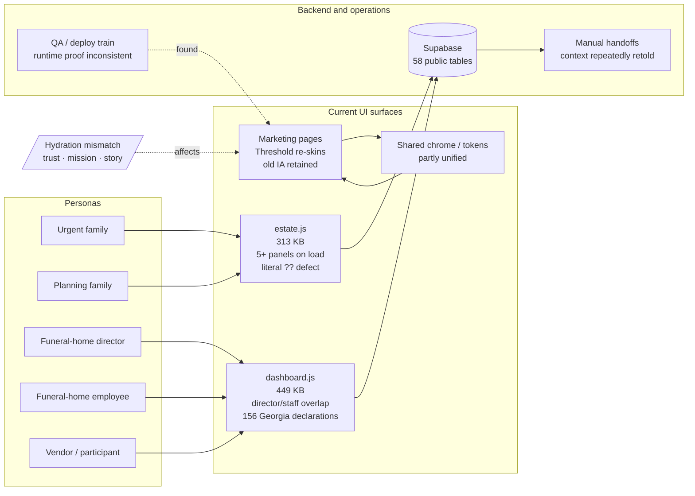
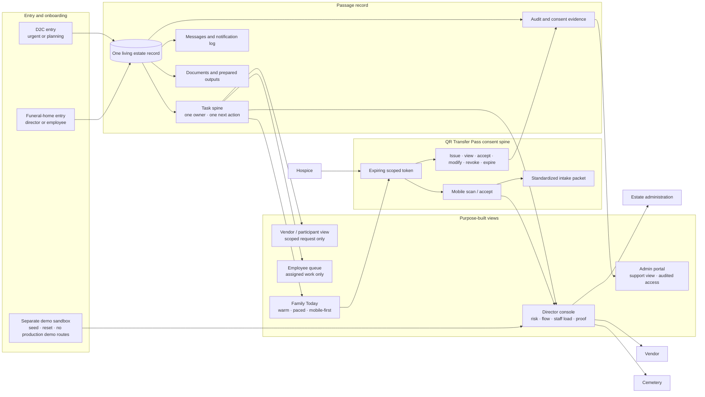
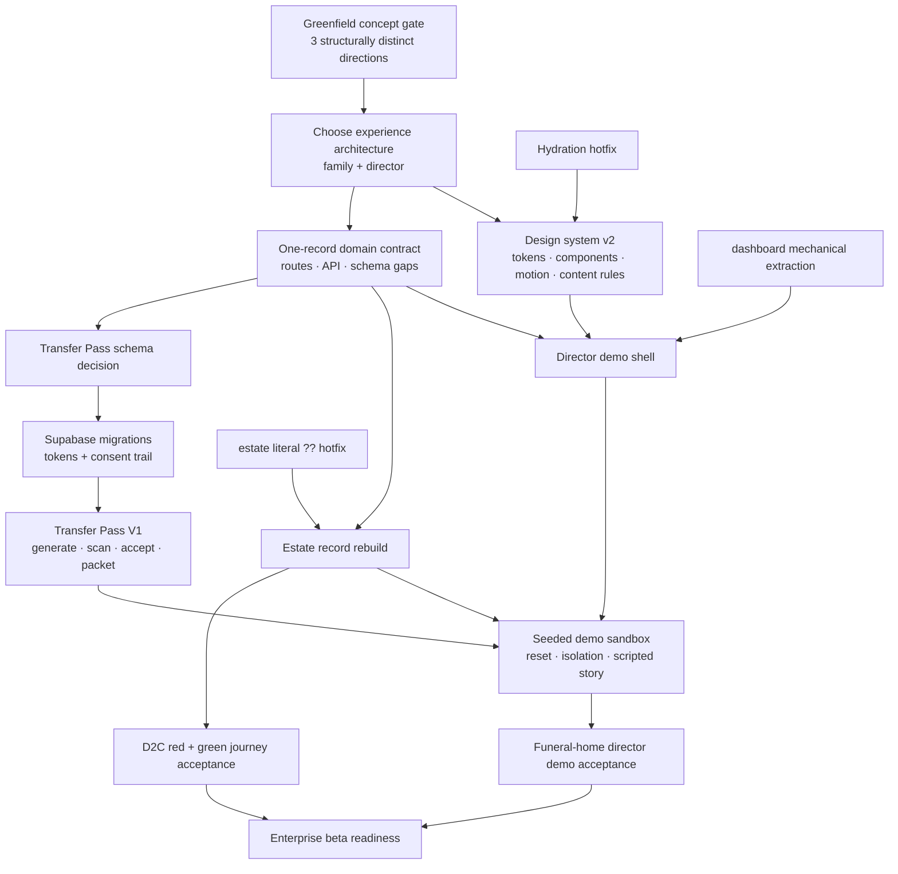

# Passage system dependency maps — greenfield target

Date: 2026-07-14  
Status: design and architecture baseline for the greenfield rebuild  
North star: enterprise-ready “death tech meets Apple empathy,” complete D2C journeys, and a separate seeded funeral-home director demo sandbox.

These maps are durable replacements for the ephemeral run-13/run-14 widgets. They distinguish what exists today from what Passage is deliberately becoming. They are not evidence that the target state is already built.

## Current state — fragmented experience over a strong backend spine

### What this exposes

- The data spine is stronger than the experience wrapped around it.
- Personas are routed into page monoliths instead of purpose-built views of one shared record.
- The shipped Threshold work changed craft tokens more than workflow structure; it is a useful visual foundation, not a completed greenfield redesign.
- QA found a real hydration defect only after production because visual checks and runtime-console checks were not consistently separated.
- No durable portable-consent primitive currently carries context between organizations.

## Target state — one living estate record, purpose-built views

### Experience contract

- Family surfaces reveal one meaningful decision at a time and explain what happens next.
- Director surfaces lead with case risk, waiting points, staff load, family-update health, and proof—not generic dashboard cards.
- Employees see only assigned work and its proof destination.
- Vendors and participants see one scoped request, never the family record.
- Every state is viewer-relative: **your move**, **waiting on**, or **handled**.
- The QR mechanism is not the product. The differentiated product is a family-controlled, portable, current record with explicit scope and an auditable consent history.
- The demo sandbox is a product capability: realistic seeded data, resettable state, isolated identities, and no demo-only production routes.

## Delivery dependency map — sprint coordination

## Gates that prevent another re-skin

1. No implementation ticket may be called greenfield unless it changes workflow structure or information architecture, not merely tokens.
2. Before the main rebuild, UX must present at least three structurally distinct concepts; “current layout with different styling” is an automatic fail.
3. The director demo must be testable from a resettable sandbox with realistic fake data and isolated auth/data.
4. Schema changes require a documented frontend need, migration, rollback posture, RLS review, and QA evidence.
5. Every user-facing batch requires desktop and mobile screenshots plus console-error evidence.
6. Compliance-adjacent Transfer Pass copy stays plain and non-legal until separately reviewed.
